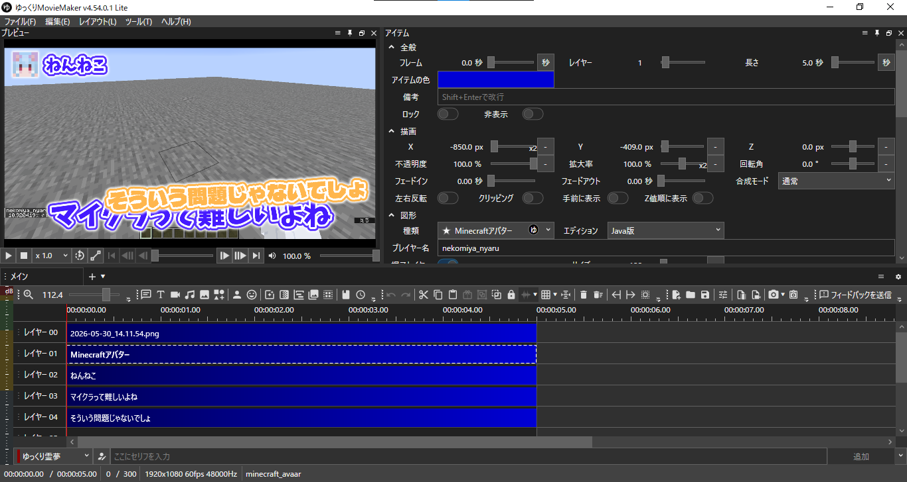

# YMM4MinecraftAvatar
YMM4でMinecraftのアバターを簡単に表示できるプラグイン。

## インストール

1. [リリースページ](https://github.com/nennneko5787/YMM4MinecraftAvatar/releases/) から最新のプラグインファイル(`.ymme`のもの)をダウンロードする。
2. ダウンロードした`.ymme`ファイルを開く。
3. 画面の指示に従ってインストールする。

## 使い方

図形の種類にMinecraftアバターが追加されているので、これを使用してください。  
**エディション**は表示したいアバターを持つユーザーのエディションを選択してください。  
プレイヤー名には表示したいアバターを持つユーザーの名前を入力してください。

## スクリーンショット

